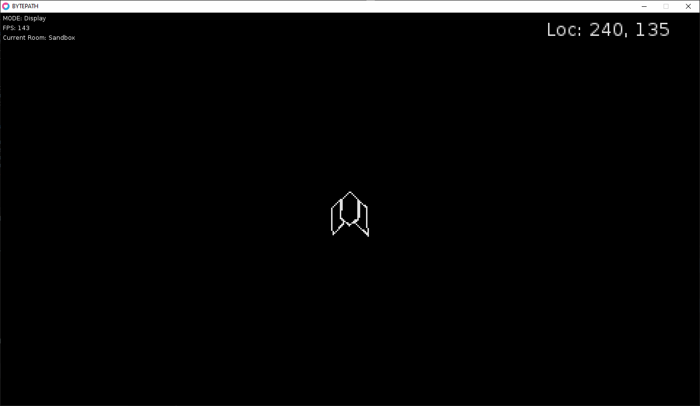

# BYTEPATH

* An asteroid like arcade game, following https://github.com/a327ex/blog/issues/30 tutorial

## Purpose

* Try out "Love2D" game engine
* Take authors player controller and play around with a neutonian physics controller

## What I accomplished

* Learn object oriented coding with lua and basics of Love2D game engine
* Tested out gameplay loop and update functions with object inheritence in lua
* 2D Vector math + simple physics practice
* Collision detection

## Dependencies
* Love2D version 10.2
* Love2d default install location (C:\Program Files\Love\) 